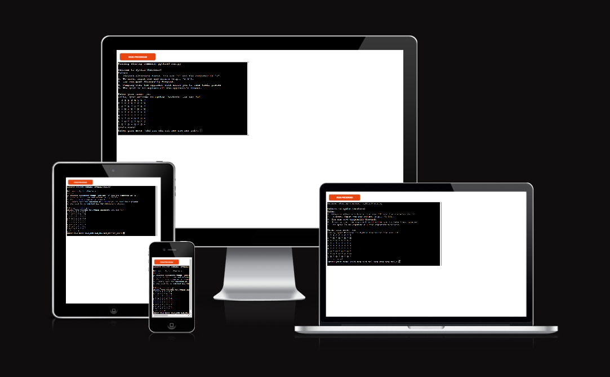

# Python Checkers!

Welcome to Python Checkers!, this is a classic strategy game brought to life in the Python terminal. This turn-based game puts you up against an AI opponent. With an 8x8 board, diagonal movement, and the ability to jump over your opponents' pieces. Python Checkers captures the essence of the original board game all while showcasing the power of Python.

[Here is my live project](https://python-checkers-9d82286035ad.herokuapp.com/)

### How to play Python Checkers.

- **Game Rules:** you can find the main rules of checkers [here!](https://en.wikipedia.org/wiki/Checkers)
- **Player vs. Computer:** As the player, you will control the 'O' pieces, while the computer will play as 'X'.
- **King Promotion:** When one of your pieces reaches the opposite end of the board, it will be promoted to a king, represented by '@'. A king gains the ability to move backward across the board. Similarly, the computer's king pieces will be represented by '#'.
- **Movement:** To move a piece, you'll need to enter the row and column of the piece you wish to move, followed by the row and column of the destination (e.g., 5 6 4 7).
- **Objective:** Your goal is to capture all of the computer's pieces and secure victory.