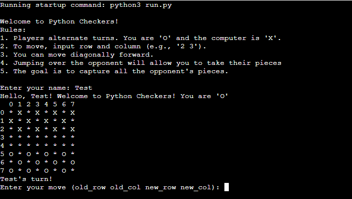
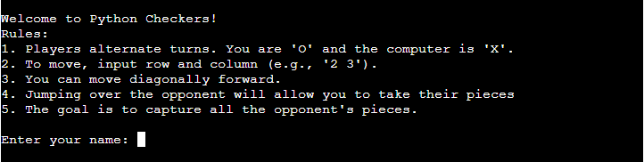
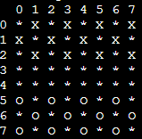
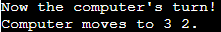
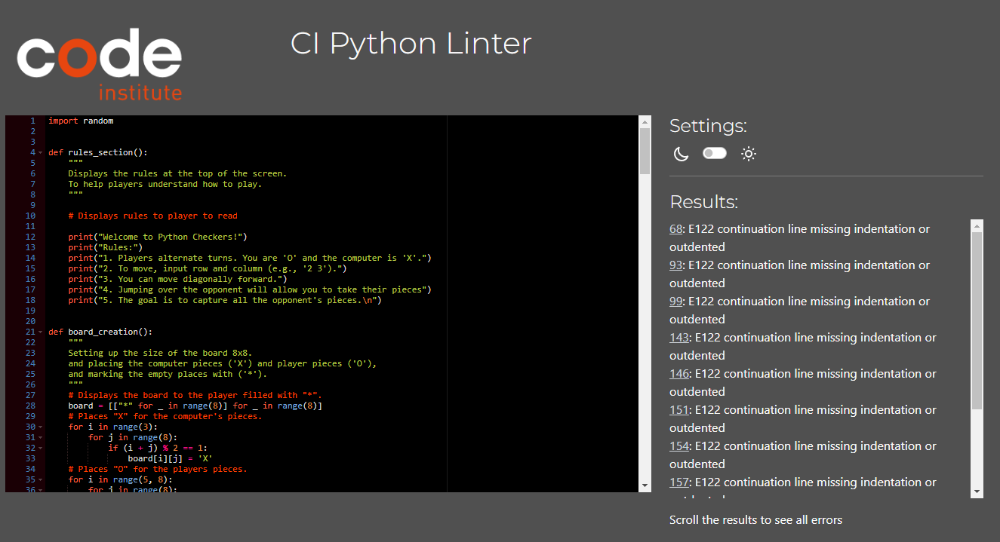
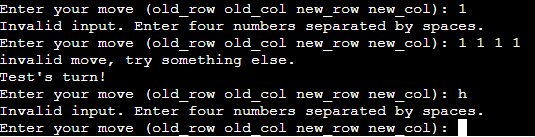

# Python Checkers!

Welcome to Python Checkers!, this is a classic strategy game brought to life in the Python terminal. This turn-based game puts you up against an AI opponent. With an 8x8 board, diagonal movement, and the ability to jump over your opponents' pieces. Python Checkers captures the essence of the original board game all while showcasing the power of Python.

[Here is my live project](https://python-checkers-9d82286035ad.herokuapp.com/)

### How to play Python Checkers.

- **Game Rules:** you can find the main rules of checkers [here!](https://en.wikipedia.org/wiki/Checkers)
- **Player vs. Computer:** As the player, you will control the 'O' pieces, while the computer will play as 'X'.
- **King Promotion:** When one of your pieces reaches the opposite end of the board, it will be promoted to a king, represented by '@'. A king gains the ability to move backward across the board. Similarly, the computer's king pieces will be represented by '#'.
- **Movement:** To move a piece, you'll need to enter the row and column of the piece you wish to move, followed by the row and column of the destination (e.g., 5 6 4 7).
- **Objective:** Your goal is to capture all of the computer's pieces and secure victory.

### Features!

- The layout of the page features the rules prominently displayed above the board, ensuring players can easily understand how to play before starting the game.

    

- Before the game begins, players are prompted to enter their name, adding a personalized touch to the experience.

    

- In the game, the board features numbered rows and columns to help players easily identify and select their pieces. Player tokens are conveniently positioned at the bottom of the board, while the computer's tokens are arranged at the top, ensuring a clear and intuitive layout for gameplay.

    

- The game allows players to input their moves, enabling them to select which piece they want to move and where they wish to move it, making for an interactive and strategic gameplay experience.

    

- The game provides feedback by displaying the computer's moves on the board with its updated coordinates, keeping the player informed of the computer's actions.

    

### Future features.

  - The game will soon include a feature allowing players to select a difficulty level, offering the option to make the game easier or harder to beat, enhancing the challenge based on their preference.

  - The game will soon feature a score-keeping system, allowing players to track their performance across multiple games for a more competitive experience.

### Testing

  - The game has been tested using the PEP8 Python validator to ensure it follows Python's style guidelines for readability and maintainability. While the validator flags some indentation issues, correcting them causes the code to malfunction and prevents the game from running properly. As a result, these indentation concerns have been intentionally left unchanged to keep the game functional.

    
    - [PEP8 Python Validator page here!](https://pep8ci.herokuapp.com/)

  - The game has been tested by intentionally inputting incorrect values to ensure that error messages are displayed correctly, helping to identify and handle potential issues.

    

  - The game was tested by playing until a piece reached the opposite side of the board, ensuring it correctly transformed from 'O' to '@' and remained on screen, with all moves functioning as expected.

### Bugs
#### solved bugs

    - Initially, while developing the game, it allowed players to move their tokens and jump over the computer's tokens, but the tokens weren't being removed as they should have been.

    - After fixing the initial bug, another issue arose where the tokens stopped responding, and the game no longer moved the pieces when the player input their location.

    - The final bug I encountered was that when tokens reached the opposite end of the board and became a king, they reverted to a normal token after leaving the back row, rather than staying as a king piece.

#### Remaining bugs

 - No more bugs remaining.

### Deployment
#### This projects was deployed using Code Institute's mock terminal for Heroku.

    1. Create a new app on the Heroku page.
    2. Set buildbacks to "Python" and "NodeJS" in that specific order
    3. Link the Heroku app to the main repository
    4. in the manual deploy section, click on "deploy branch" from "main"

### Credits
- Code Institute deployment terminal.
- Code ideas from [stack overflow](https://stackoverflow.com/) and [Free Code Camp](https://forum.freecodecamp.org/)
- Help with some finer detail code from [Chat GBT](https://forum.freecodecamp.org/)